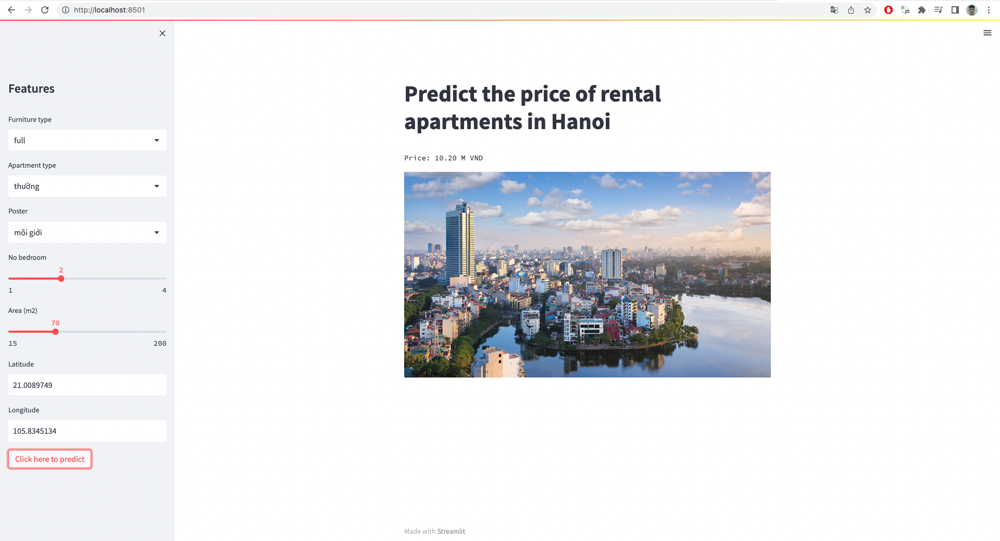

# Final capstone project
* Objective: The aim of the project is to build a predictive model that can predict the rental price of an apartment based on several features in Hanoi.

## Run project
* Install dependencies:
```angular2html
pip3 install -r requirements.txt
```

* Please read the [capstone report](./Capstone_Report.pdf) to get more information

* I also built an API service and Web demo. There are some steps to run them.
```angular2html
cd demo

# Run API services
python3 main.py

# Run UI
streamlit run Capstone_Project.py
```
* Here is a sample prediction on my UI:
* 
